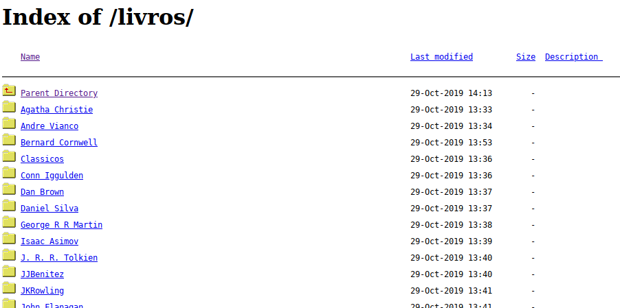

Diretórios abertos são pastas que enviados para web servers que não são protegidas contra indexação, ou seja, podem ser encontradas pelo Google. Com isso você consegue ter acesso ao conteúdo dessas pastas apenas acessando via URL.

Essa é uma página padrão de um diretório aberto, mostrando todo seu conteúdo



Diretórios abertos não são necessariamente uma falha de segurança, podem ser intencionais e em alguns casos podem sim ser considerados uma vulnerabilidade.

Esse post não tem a intenção de ensinar como expor conteúdos sensíveis de terceiros mas sim explorar diretórios aberto para encontrar qualquer arquivo de diversos formatos usando apenas o Google e para isso temos que fazer o uso de três keywords avançadas na busca:

intext: que permite encontrar qualquer texto no corpo da página
intitle: que permite encontrar qualquer texto no título da página
inurl: que permite que você encontre qualquer texto na url

combinando-as conseguimos encontrar diretórios abertos para baixar algum arquivo disponível

aqui estão as extensões mais populares de arquivos:

- Livros (pdf|epub|mob)
- Música (ac3|flac|m4a|mp3|ogg|wav|wma)
- Imagens (bmp|gif|jpg|png|psd|tif|tiff)
- Filmes/videos (wmv|mpg|avi|mp4|mkv|mov)

Podemos combinar essas extensões com as keywords, e inclusive negativar keywords colocando um sinal de menos.

Vamos fazer um teste na tentativa de achar o livro **O Cortiço de Aluísio Azevedo**, e ver ficaria a nossa pesquisa.

Primeiramente vamos separar as extensões mais populares de arquivos para livros

**_lembrando que esse livro é de domínio público_**

1. no intext colocamos o nome do arquivo que queremos buscar
2. no intitle colocamos index.of que é o título padrão de diretórios abertos
3. em inurl com um sinal de negativo conseguimos excluir algumas extensões de site que tenta se passar por um diretório aberto

então a busca do Google ficaria assim:

```
intext:"O Cortiço" intitle:"index.of" (pdf|epub|mob) -inurl:(jsp|pl|php|html|aspx|htm|cf|shtml)
```

<br />
Para uma explicação detalhada em video você pode acompanhar essa thread no Twitter do Fernado(Código Falado), que foi usada como fonte para criação deste post: https://twitter.com/CodigoFalado/status/1221571970736836612
